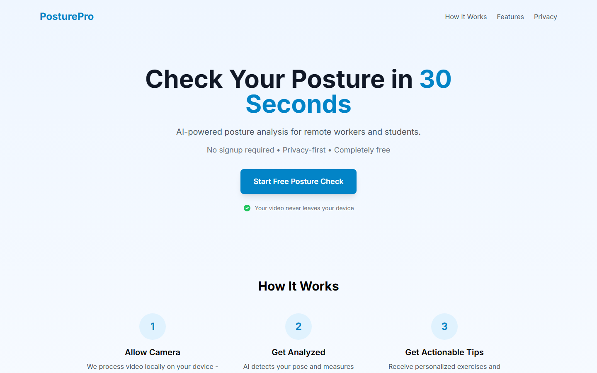
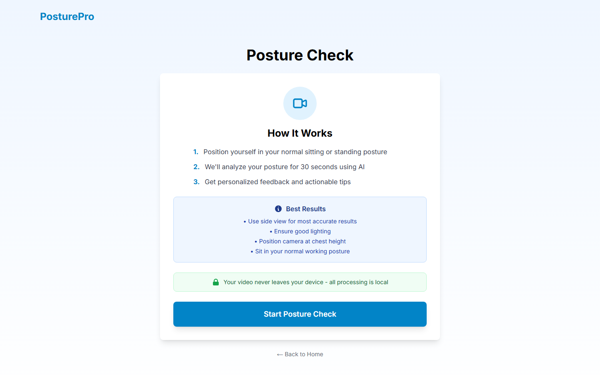

# PosturePro - AI Posture Analysis App

A privacy-first web application that uses AI to analyze and provide feedback on posture issues for remote workers and students.

## Features

- **Real-time Posture Detection**: Uses MediaPipe Pose and TensorFlow.js for accurate pose estimation
- **Privacy-First**: All processing happens client-side - video never leaves your device
- **No Signup Required**: Instant access to posture checking
- **Actionable Feedback**: Get specific exercises and ergonomic tips
- **Progress Tracking**: Monitor improvements over time (optional account)

## Tech Stack

- **Frontend**: Next.js 14 + TypeScript + TailwindCSS
- **ML/AI**: TensorFlow.js + MediaPipe Pose
- **Deployment**: Vercel (planned)
- **Analytics**: PostHog (privacy-preserving, planned)

## Getting Started

### Prerequisites

- Node.js 18+ and npm

### Installation

```bash
npm install
```

### Development

```bash
npm run dev
```

Open [http://localhost:3000](http://localhost:3000) to see the app.

### Build

```bash
npm run build
npm start
```

## Project Structure

```
/app
  /check          - Posture checking page with camera
  /dashboard      - User progress tracking (future)
  /privacy        - Privacy policy
  /terms          - Terms of service
/components
  /camera         - Camera and pose detection components
  /ui             - Reusable UI components
/lib
  /posture        - Posture analysis algorithms
  /storage        - Local storage utilities
/types            - TypeScript type definitions
```

## Detected Posture Issues

- Forward Head Posture (FHP)
- Rounded Shoulders
- Shoulder Asymmetry
- Slouching/Hunched Sitting
- Anterior Pelvic Tilt
- Head Tilt/Rotation

## Medical Disclaimer

This app provides educational information about posture. It is NOT a medical device and does NOT diagnose or treat medical conditions. Always consult a healthcare professional for persistent pain or health concerns.

## License

MIT (to be confirmed)

## Screenshots



Landing page with the app value proposition for remote workers and students.



Posture check flow (intro state before camera capture) with session duration controls.

## Roadmap

- [x] Project setup
- [x] MediaPipe integration
- [x] Core posture detection
- [x] Real-time feedback UI
- [x] Session tracking
- [x] Educational content
- [ ] Progress dashboard
- [ ] Reminder system
- [ ] PWA capabilities
- [ ] Freemium features
