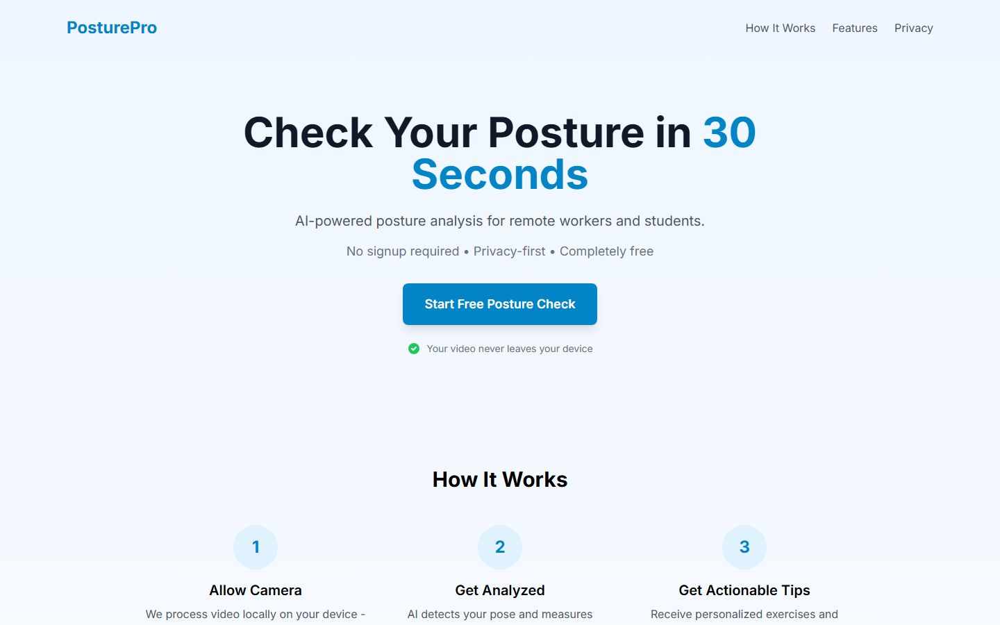
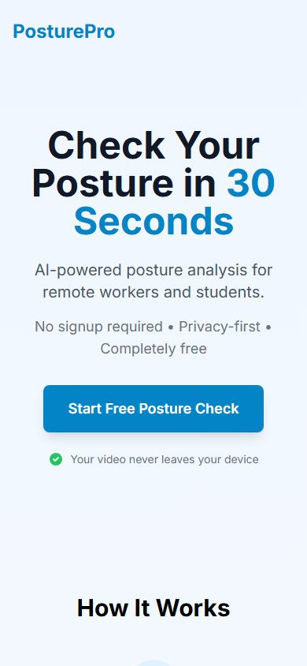

# PosturePro

Aplicación web para revisar tu postura frente a la computadora. Está pensada para personas que trabajan en remoto y para estudiantes. Todo el análisis corre en tu navegador y el video nunca sale de tu dispositivo.

Esta app todavía no tiene sitio publicado. Las capturas salen de una corrida local.

## Qué hace

- Detecta la pose en tiempo real con MediaPipe Pose y TensorFlow.js.
- Revisa seis problemas: cabeza adelantada, hombros redondeados, asimetría de hombros, inclinación pélvica anterior, encorvarse al sentarse e inclinación o giro de la cabeza.
- Sugiere ejercicios y consejos de ergonomía para cada problema (`app/exercises`).
- No pide registro y guarda el historial de sesiones solo en tu equipo.
- Incluye páginas de privacidad y términos.

Los algoritmos de análisis están en `lib/posture/analyzer.ts` y `lib/posture/geometry.ts`.

## Tecnologías

Next.js 14, React 18, TypeScript, Tailwind CSS, TensorFlow.js y MediaPipe Pose.

## Capturas





## Cómo correrlo en local

Necesitas Node.js 18 o más nuevo.

```bash
npm install
npm run dev
```

Abre http://localhost:3000. No usa variables de entorno.

## Pendiente

- Panel de progreso
- Sistema de recordatorios
- Soporte PWA

## Aviso médico

Esta app da información educativa sobre postura. No es un dispositivo médico y no diagnostica ni trata ninguna condición. Si tienes dolor constante, consulta a un profesional de la salud.

## Licencia

[MIT](LICENSE)
